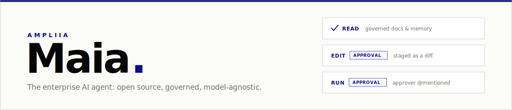
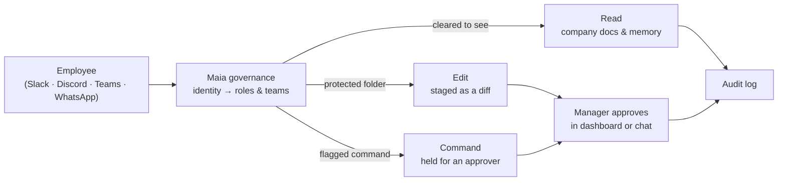

<div align="center">



**An AI agent for the enterprise. Open source. Free.**

Role-aware conversations, governed file access, human-in-the-loop approvals, and corporate audit — on top of the Hermes Agent runtime.

[About Maia](https://ampliia.com/en/maia/) · [Documentation](https://ampliia.com/en/maia/docs/) · [Install](#install) · [Governance](#corporate-governance) · [Security](SECURITY.md)

[](LICENSE)

[](https://github.com/and270/maia/actions/workflows/lint.yml)

[](LICENSE)

</div>

Maia is a private one-tenant corporate AI assistant by [AmpliIA](https://ampliia.com/en/), based on the upstream Hermes Agent codebase and refit for company use: role-aware gateway conversations, governed folder access, corporate/team/user knowledge layers, guarded migration from upstream Hermes exports, human-in-the-loop cron authorization, and corporate observability.

## Why Maia

| | |
|---|---|
| 🗂️ **Governed file access** — folder policies by role, team, or user; default-deny for production; delegated roots that team leads manage themselves. | ✅ **Human-in-the-loop approvals** — file changes staged as reviewable diffs, flagged commands routed to approver roles, knowledge and cron approvals with chat buttons and @mentions. |
| 🧠 **Layered knowledge** — corporate, team, and user memories/skills with explicit precedence; shared layers change only through approval. | 💬 **Multi-channel gateway** — Slack, Discord, Mattermost, Matrix, Telegram, WhatsApp, and more, with per-user sessions and `platform:user_id` identity mapping. |
| 🔁 **Model agnostic** — major cloud APIs, OpenAI-compatible endpoints, or fully local models on your servers, with multi-provider fallback. | 📜 **Audit & observability** — append-only audit JSONL for every allow, deny, and approval, plus optional SIEM webhook export. |

## How a request is governed



Every allow, deny, and approval is recorded; anything outside the actor's policy is blocked. Requesters can never approve their own gated changes.

## Model agnostic by design

Maia treats the LLM as a replaceable component: switching providers is a configuration change (`maia model`), not a rewrite. The same conversations, skills, memories, approvals, and policies keep working when the model changes.

| Cloud APIs | Local / self-hosted | Resilience |
|---|---|---|
| Anthropic, OpenAI, Google Gemini, Mistral, DeepSeek, xAI, OpenRouter, and any OpenAI-compatible endpoint. | Ollama, LM Studio, or any compatible inference server on your own hardware — **no data leaves the company**, a natural fit for sensitive documents, LGPD/GDPR, and air-gapped networks. | Multi-provider fallback keeps operations running through provider outages, account blocks, model deprecations, or price changes. No vendor lock-in: governance, audit trails, and corporate knowledge stay yours. |

Provider keys live in the managed `.env` credential flow — never in prompts, memories, skills, or docs.

## Commands

The installed commands are renamed so operators do not use the upstream `hermes` command name:

```bash
maia              # interactive assistant
maia gateway      # messaging gateway
maia cron list    # scheduled workflows
maia model        # model/provider selection
maia doctor       # diagnostics
maia-acp          # ACP editor integration
maia-agent        # direct agent runner
```

## Install

### macOS / Linux

```bash
git clone https://github.com/and270/maia.git
cd maia
./setup-maia.sh
# Only needed if setup says it added the command directory to your shell config.
source ~/.zshrc
maia setup
maia
```

### Windows (WSL)

Maia runs on Windows through WSL2 (same recommendation as upstream Hermes).
One-time WSL setup from PowerShell (as Administrator), then reboot if asked:

```powershell
wsl --install -d Ubuntu
```

Then, inside the Ubuntu/WSL terminal:

```bash
sudo apt update && sudo apt install -y git curl build-essential

# IMPORTANT: clone into the Linux filesystem (your WSL home, "~"),
# NOT into /mnt/c/... — installs on the Windows filesystem are slow
# and are the most common cause of failed installs on WSL.
git clone https://github.com/and270/maia.git ~/maia
cd ~/maia
./setup-maia.sh
source ~/.bashrc
maia setup
maia
```

Notes for WSL:
- The `maia` command works from any directory once your shell is reloaded.
- The dashboard build (`maia dashboard`) needs Node.js 20+:
  `sudo apt install -y nodejs npm` (or use [nvm](https://github.com/nvm-sh/nvm) for a newer Node).
- Keep company files you want Maia to govern inside WSL (e.g. `~/company-files`)
  for the same filesystem-performance reason. Windows paths remain reachable
  under `/mnt/c/...` when needed.

### Manual development install

```bash
uv venv .venv --python 3.11
source .venv/bin/activate
uv pip install -e ".[all,dev]"
maia --help
```

## Dashboard Access

Local setup:

```bash
maia dashboard
```

The dashboard binds to `127.0.0.1` by default. It can edit `.env`, `config.yaml`, folder policies, cron jobs, knowledge approvals, plugins, and model settings, so configure protected mode before serving it on an intranet or public interface:

```yaml
dashboard:
  auth:
    enabled: true
    token_env: MAIA_DASHBOARD_TOKEN
    local_token_roles: [admin]
    read_roles: [auditor, manager, admin]
    manage_roles: [manager, admin]
    admin_roles: [admin]
```

```bash
export MAIA_DASHBOARD_TOKEN="$(openssl rand -base64 32)"
maia dashboard --host 0.0.0.0 --no-open
```

Use a TLS reverse proxy or private network boundary for public access. Maia refuses non-loopback dashboard binding unless `dashboard.auth` is configured, unless `--insecure` is explicitly used for temporary trusted-network testing.

Use the local token for bootstrap and system-admin access. Default built-in flow for team leaders is dashboard-first:

1. A user sends `/dashboard` in a private/direct chat with the bot.
2. Maia creates a pending request in **Dashboard Access** instead of asking anyone to edit YAML.
3. A system admin opens **Dashboard Access**, reviews the `platform:user_id`, assigns roles and teams, and approves or denies the request.
4. After approval, the user sends `/dashboard` again and receives a short-lived one-time token for the dashboard login form.
5. The admin can revoke or restore that dashboard access from the same page.

Channel-token config:

```yaml
dashboard:
  auth:
    enabled: true
    channel_tokens:
      enabled: true
      ttl_minutes: 10
      dashboard_url: "https://maia.company.example"
      require_dm: true
      approval_required: true
```

Maia does not provide SSO, VPN, zero-trust networking, or an identity-aware proxy. If your company already has that access layer, Maia can sit behind it and consume trusted identity headers such as `X-Auth-Request-User`.

## Corporate Governance

Maia keeps the existing gateway, tool, memory, and cron capabilities, but adds a `governance` section in `<MAIA_HOME>/config.yaml`. The dashboard writes role and team assignments into that section when an admin approves a dashboard access request. Server operators can still edit the YAML directly for infrastructure-as-code, backup restore, or break-glass recovery.

```yaml
governance:
  enabled: true
  tenant_id: acme-corp
  default_role: viewer
  role_hierarchy: [viewer, operator, manager, admin]
  users:
    "slack:U_FINANCE":
      name: Finance Manager
      roles: [manager]
      teams: [finance]
    "slack:U_MARKETING":
      name: Marketing Lead
      roles: [manager]
      teams: [marketing]
    "telegram:987654":
      name: Platform Admin
      roles: [admin]
  default_file_policy: deny
  team_file_roots:
    marketing:
      path: "/srv/company/marketing"
      manager_roles: [manager]
      managers: ["slack:U_MARKETING"]
  folder_policies:
    - path: "/srv/company/shared"
      read_roles: [viewer]
      write_roles: [operator]
    - path: "/srv/company/finance"
      read_teams: [finance]
      write_roles: [manager]
    - path: "/srv/company/marketing"
      read_teams: [marketing]
      write_users: ["slack:U_MARKETING"]
    - path: "/srv/company/security"
      read_roles: [admin]
      write_roles: [admin]
  gateway:
    group_sessions_per_user: true
    thread_sessions_per_user: false
  cron:
    default_authorizer_roles: [admin]
```

What this enforces today:

- Gateway users can be mapped to roles by `platform:user_id`.
- Shared gateway threads remain multi-user by default, while non-thread group chats stay isolated per participant.
- `read_file`, `search_files`, `write_file`, `patch`, and the lower-level file operation layer check configured folder policies. These policies are the server-side maximum directories Maia may access for any channel, cron job, or dashboard-triggered action.
- Admins manage global file access from dashboard **File Access** or server-side YAML. Team leaders use the same page after dashboard login, but only for delegated roots such as `/srv/company/marketing`, and only for users or teams assigned to that managed team.
- Corporate memory/skills are injected into every conversation; team memory/skills are injected by team membership; user memory/skills stay profile-level.
- Corporate and team memory/skill edits are staged for approval and applied only by authorized humans in the Knowledge panel/API.
- Cron jobs can pause at an authorization node until an allowed user or role approves them.

## Role-Aware Self-Configuration Skill

Maia keeps the upstream `hermes-agent` skill, but extends it with a live governance block rendered at skill load time. The block includes the current actor, roles, teams, tenant, dashboard read/manage/admin gates, delegated team file roots, shared-knowledge approval roles, and cron authorization defaults.

This makes the agent aware of what it may configure for the current user:

- Operators and viewers can do assigned work only inside enabled tools and allowed folders. They must not change global config, secrets, models, providers, dashboard auth, roles, folder policies, plugins, MCP servers, toolsets, or gateway settings.
- Managers can act only inside the configured management surface: approval decisions, shared-knowledge approvals allowed by role, and delegated File Access roots.
- Admins can perform global self-configuration when requested, but should preserve dashboard auth, audit logging, human approvals, and default-deny file policy unless a reviewed change explicitly says otherwise.

Corporate and team memory/skill changes are still proposal-first. The skill tells the agent to use `memory(scope="team"|"corporate", ...)` or `skill_manage(scope="team"|"corporate", ...)` with an `approval_note`, not to edit shared knowledge files directly. Server-side governance remains authoritative: if a file operation, dashboard action, or cron approval is denied, the model must ask an authorized manager/admin instead of bypassing the policy.

Create a scheduled flow with an approval gate:

```python
cronjob(
  action="create",
  name="Quarterly finance package",
  prompt="Review the finance folder and draft the quarterly summary.",
  schedule="0 9 * * MON",
  workdir="/srv/company/finance",
  authorization={"required": True, "roles": ["manager"]},
)
```

When the job becomes due, it is paused with `state: awaiting_authorization`. An authorized manager can continue it:

```python
cronjob(action="authorize", job_id="abc123")
```

or reject it:

```python
cronjob(action="deny", job_id="abc123", reason="Close not complete yet")
```

## Security Baseline

The governance design follows current enterprise AI-agent guidance:

- NIST AI RMF emphasizes governing, mapping, measuring, and managing AI risks across the AI lifecycle: https://www.nist.gov/itl/ai-risk-management-framework
- CSA AI Controls Matrix provides a vendor-neutral AI controls framework mapped to standards including ISO 42001, ISO 27001, and NIST AI RMF: https://cloudsecurityalliance.org/artifacts/ai-controls-matrix
- Microsoft Entra guidance treats agents as governed identities with authentication, authorization, lifecycle controls, and monitoring: https://learn.microsoft.com/en-us/entra/agent-id/identity-professional/security-for-ai

For deployment details, see [SECURITY.md](SECURITY.md).
For configuration details, see [docs/enterprise-governance.md](docs/enterprise-governance.md).

## Admin Onboarding

Start with the administrator flow:

- [docs/admin-onboarding.md](docs/admin-onboarding.md) — tenant, roles, gateway identities, folder access, cron approvals, and audit retention.
- [docs/knowledge-governance.md](docs/knowledge-governance.md) — corporate, team, and user memory/skill layers plus the approval flow.
- [docs/migration-from-hermes.md](docs/migration-from-hermes.md) — guarded import for upstream Hermes tar/tar.gz exports.
- [docs/cron-authorization-panel.md](docs/cron-authorization-panel.md) — dashboard and tool approval checkpoints per role or user.
- [docs/observability.md](docs/observability.md) — runtime logs, audit JSONL, SIEM webhook export, and current telemetry coverage.

The dashboard also includes an **Onboarding** page with the same admin checklist.

## Migrating From Upstream Hermes

Use guarded migration mode for a Hermes export archive:

```bash
maia import ~/Downloads/hermes-export.tar.gz --from-hermes-export
```

This stages memories and skills for review, imports MCP servers disabled by default, copies secrets only into the migration review folder, and preserves Maia governance guardrails. Promote reviewed content into corporate or team knowledge only through the Knowledge approval workflow.

## Observability

Operational logs are available through `maia logs` and the dashboard Logs page. Corporate audit events are written to `<MAIA_HOME>/logs/audit.jsonl` and include governance file denials, knowledge approvals, cron authorization requests/decisions, dashboard access requests/approvals/revocations, dashboard login/logout, dashboard role denials, and mutating dashboard API calls.

```bash
maia logs audit
```

## License

Maia is an AmpliIA distribution that includes upstream Hermes Agent components under the MIT License. Nous Research is credited for the upstream Hermes Agent code as required by the preserved MIT notice in [LICENSE](LICENSE).
